# Rapport de Projet SCRUM
## Application de Gestion des Événements de la FSTT

---

**Module :** Méthode Agile SCRUM  
**Professeur :** Prof. Chaker EL AMRANI  
**Date :** Janvier 2026

---

### Membres du Groupe

| Nom et Prénom | Rôle SCRUM | Responsabilités |
|---------------|------------|-----------------|
| KHAZRI Salah | Product Owner | Définition des Epics, vision produit, priorisation du backlog, validation des livrables |
| BERQIA Badr | SCRUM Master | Gestion Jira, création des User Stories, Code Review, Testing, animation des cérémonies |
| EL AJBARI Youssef | Developer | Développement Backend (FastAPI, API REST, Base de données) |
| GANOUN Omar | Developer | Développement Frontend (React, Interface utilisateur) |
| OUALLALI Mohamed Amine | Developer | Développement Full-Stack (Support Backend/Frontend) |

---

## Table des Matières

1. [Introduction et Problématique](#1-introduction-et-problématique)
2. [Installation de Jira Software](#2-installation-de-jira-software)
3. [Création de l'Équipe SCRUM](#3-création-de-léquipe-scrum)
4. [Création des Epics](#4-création-des-epics)
5. [Product Backlog et Product Goal](#5-product-backlog-et-product-goal)
6. [Sprint Backlog : User Stories et Tasks](#6-sprint-backlog--user-stories-et-tasks)
7. [Amélioration du Workflow](#7-amélioration-du-workflow)
8. [Stratégie d'Organisation et Cérémonies SCRUM](#8-stratégie-dorganisation-et-cérémonies-scrum)
9. [Livrables du Sprint](#9-livrables-du-sprint)
10. [Analyse des Graphiques Jira](#10-analyse-des-graphiques-jira)
11. [Sprint Review](#11-sprint-review)
12. [Sprint Retrospective](#12-sprint-retrospective)
13. [Conclusion](#13-conclusion)

---

## 1. Introduction et Problématique

### 1.1 Contexte

La Faculté des Sciences et Techniques de Tanger (FSTT) organise régulièrement des événements académiques, culturels et sportifs. La gestion manuelle de ces événements pose plusieurs défis : difficulté de communication, gestion des inscriptions dispersée, et manque de visibilité sur les participations.

### 1.2 Problématique

Comment faciliter la gestion des événements de la FSTT et améliorer l'expérience des étudiants et du personnel dans le processus d'inscription et de suivi des événements ?

### 1.3 Solution Proposée

Développer une application web permettant :
- La création et la gestion des événements par les administrateurs
- L'inscription et la désinscription des utilisateurs aux événements
- La catégorisation des événements (conférence, formation, atelier, club, sport)
- Le suivi du statut des événements (en cours, complet, annulé, terminé)
- L'interaction via les commentaires
- L'historique des participations

### 1.4 Stack Technique

| Composant | Technologie |
|-----------|-------------|
| Backend | Python avec FastAPI |
| Frontend | React avec Vite |
| Base de données | SQLite avec SQLAlchemy |
| Gestion de projet | Jira Software (Cloud) |

---

## 2. Installation de Jira Software

### 2.1 Choix de la Plateforme

Pour ce projet, nous avons utilisé **Jira Software Cloud** accessible via [jira.atlassian.com](https://jira.atlassian.com). Cette solution offre :
- Accessibilité depuis n'importe quel navigateur web
- Pas besoin d'installation locale
- Fonctionnalités complètes de gestion de projet SCRUM
- Rapports et graphiques automatiques

### 2.2 Création du Projet

1. Connexion à Jira Cloud avec un compte Atlassian
2. Création d'un nouveau projet avec le template **"Scrum"**
3. Configuration du projet :
   - **Nom du projet :** FSTT-Events
   - **Clé du projet :** SCRUM
   - **Type :** Software Development (Scrum)

---

## 3. Création de l'Équipe SCRUM

### 3.1 Les Rôles SCRUM

Notre équipe est composée de 5 membres jouant les rôles suivants :

**Product Owner : KHAZRI Salah**
- Responsable de la vision du produit
- Création et définition des Epics
- Priorisation du Product Backlog
- Validation des livrables à la fin du sprint

**SCRUM Master : BERQIA Badr**
- Gestion et configuration de Jira
- Création des User Stories à partir des Epics
- Animation des cérémonies SCRUM (Daily, Planning, Review, Retrospective)
- Revue de code (Code Review)
- Tests fonctionnels et validation (Testing)
- Élimination des obstacles de l'équipe

**Developers (Team) :**
- **EL AJBARI Youssef** : Développement Backend (FastAPI, API REST, Base de données)
- **GANOUN Omar** : Développement Frontend (React, Interface utilisateur)
- **OUALLALI Mohamed Amine** : Développement Full-Stack (Support Backend/Frontend)

### 3.2 Configuration dans Jira

L'équipe a été ajoutée dans Jira via **Project Settings → People** avec les rôles appropriés assignés à chaque membre.

---

## 4. Création des Epics

### 4.1 Définition des Epics

Les Epics représentent les grandes fonctionnalités du système. Nous avons identifié 5 Epics correspondant aux besoins fonctionnels de l'application :

| Epic | Description | Justification |
|------|-------------|---------------|
| **Gestion des Utilisateurs** | Authentification et gestion des profils utilisateurs | Permet de sécuriser l'accès et de différencier les rôles (Admin/User) |
| **Gestion des Événements** | Création, modification, suppression et affichage des événements | Fonctionnalité centrale de l'application |
| **Système d'Inscription** | Inscription et désinscription aux événements | Permet aux utilisateurs de participer aux événements |
| **Catégorisation** | Gestion des catégories d'événements | Facilite l'organisation et la recherche des événements |
| **Interactions** | Commentaires et historique des participations | Améliore l'engagement des utilisateurs |

### 4.2 Création dans Jira

Chaque Epic a été créé dans Jira avec :
- Un nom descriptif
- Une description détaillée
- Une couleur distincte pour faciliter l'identification visuelle

---

## 5. Product Backlog et Product Goal

### 5.1 Product Goal

> **"Développer une application web fonctionnelle permettant la gestion complète des événements de la FSTT, incluant la création d'événements, l'inscription des participants, et le suivi des participations."**

### 5.2 Product Backlog

Le Product Backlog contient l'ensemble des User Stories identifiées, ordonnées par priorité :

| Priorité | ID | User Story | Epic | Story Points |
|----------|-----|------------|------|--------------|
| P1 | SCRUM-7 | En tant qu'utilisateur, je peux créer un compte | Gestion des Utilisateurs | 3 |
| P1 | SCRUM-8 | En tant qu'utilisateur, je peux me connecter | Gestion des Utilisateurs | 5 |
| P1 | SCRUM-9 | En tant qu'utilisateur, je peux voir la liste des événements | Gestion des Événements | 5 |
| P1 | SCRUM-10 | En tant qu'admin, je peux créer un événement | Gestion des Événements | 5 |
| P2 | SCRUM-11 | En tant qu'admin, je peux modifier/supprimer un événement | Gestion des Événements | 3 |
| P2 | SCRUM-12 | En tant qu'admin, je peux changer le statut d'un événement | Gestion des Événements | 2 |
| P1 | SCRUM-13 | En tant qu'utilisateur, je peux m'inscrire à un événement | Système d'Inscription | 5 |
| P2 | SCRUM-14 | En tant qu'utilisateur, je peux voir mes inscriptions | Système d'Inscription | 3 |
| P2 | SCRUM-15 | En tant qu'utilisateur, je peux annuler mon inscription | Système d'Inscription | 2 |
| P3 | SCRUM-16 | En tant qu'utilisateur, je peux filtrer les événements par catégorie | Catégorisation | 3 |
| P3 | SCRUM-17 | En tant qu'admin, je peux gérer les catégories | Catégorisation | 3 |
| P3 | SCRUM-18 | En tant qu'utilisateur, je peux commenter un événement | Interactions | 3 |
| P3 | SCRUM-19 | En tant qu'utilisateur, je peux voir l'historique de mes participations | Interactions | 2 |

**Total : 13 User Stories = 44 Story Points**

---

## 6. Sprint Backlog : User Stories et Tasks

### 6.1 Sprint 1 - MVP FSTT Events

**Durée :** 7 jours (12 janvier 2026 - 19 janvier 2026)

**Sprint Goal :**
> *"Livrer un MVP fonctionnel permettant la gestion et l'inscription aux événements FSTT"*

### 6.2 Décomposition en Tasks

Chaque User Story a été décomposée en tasks techniques :

**Exemple : SCRUM-9 - Voir la liste des événements (5 pts)**

| Task | Estimation | Assigné à |
|------|------------|-----------|
| Créer le modèle Event (Backend) | 2h | EL AJBARI Youssef |
| Créer l'API GET /events | 2h | EL AJBARI Youssef |
| Créer le composant EventList (Frontend) | 3h | GANOUN Omar |
| Intégrer l'API dans le frontend | 1h | OUALLALI Mohamed Amine |
| Code Review | 30min | BERQIA Badr |
| Tests fonctionnels | 30min | BERQIA Badr |

### 6.3 Estimation avec Story Points

L'équipe a utilisé la suite de Fibonacci (1, 2, 3, 5, 8, 13) pour estimer la complexité des User Stories :

- **2-3 points :** Tâches simples (modification de statut, annulation)
- **5 points :** Tâches moyennes (création d'entité, affichage de liste)
- **8+ points :** Tâches complexes (non utilisé dans ce sprint)

---

## 7. Amélioration du Workflow

### 7.1 Workflow Standard vs Amélioré

**Workflow par défaut Jira :**
```
TO DO → IN PROGRESS → DONE
```

**Notre workflow amélioré :**
```
TO DO → IN PROGRESS → CODE REVIEW → TESTING → DONE
```

### 7.2 Justification des Nouveaux Statuts

| Statut | Description | Responsable |
|--------|-------------|-------------|
| **TO DO** | Tâche prête à être développée | - |
| **IN PROGRESS** | Développement en cours | Developers (Youssef, Omar, Mohamed Amine) |
| **CODE REVIEW** | Code terminé, en attente de revue | SCRUM Master (BERQIA Badr) |
| **TESTING** | En phase de test fonctionnel | SCRUM Master (BERQIA Badr) |
| **DONE** | Terminé et validé | Validé par PO (KHAZRI Salah) |

### 7.3 Impact sur le Projet

L'ajout des statuts **CODE REVIEW** et **TESTING** permet :
- Une meilleure traçabilité du cycle de vie des tâches
- L'identification des goulots d'étranglement
- L'amélioration de la qualité du code
- Une communication claire sur l'état d'avancement

---

## 8. Stratégie d'Organisation et Cérémonies SCRUM

### 8.1 Stratégie d'Organisation des Sprints

Notre stratégie pour ce projet d'une semaine :

| Jour | Focus | Objectif |
|------|-------|----------|
| Jour 1  | Setup + Sprint Planning | Configuration Jira, définition du Sprint Backlog |
| Jour 2  | Authentification | SCRUM-7, SCRUM-8 terminés |
| Jour 3  | Affichage et création | SCRUM-9, SCRUM-10 terminés |
| Jour 4  | Gestion événements | SCRUM-11, SCRUM-12, SCRUM-13 terminés |
| Jour 5  | Inscriptions | SCRUM-14, SCRUM-15 terminés |
| Jour 6  | Catégorisation et interactions | SCRUM-16, SCRUM-17, SCRUM-18 terminés |
| Jour 7  | Finalisation | SCRUM-19 terminé, Sprint Review, Retrospective |

### 8.2 Cérémonies SCRUM

#### Sprint Planning (Jour 1 - 1h)

**Participants :** Toute l'équipe

**Déroulement :**
1. Le Product Owner (KHAZRI Salah) présente le Product Goal et les Epics définis
2. Le SCRUM Master (BERQIA Badr) crée les User Stories à partir des Epics
3. L'équipe discute et clarifie chaque User Story
4. Estimation collective avec Planning Poker
5. Sélection des User Stories pour le Sprint (44 points)
6. Définition du Sprint Goal
7. Décomposition en tasks et assignation aux développeurs

**Résultat :** Sprint Backlog validé avec 13 User Stories

#### Daily Meeting (Jours 2-7 - 15 min/jour)

**Participants :** Toute l'équipe (debout)
**Animé par :** SCRUM Master (BERQIA Badr)

**Format :** Chaque membre répond à 3 questions :
1. Qu'ai-je fait hier ?
2. Que vais-je faire aujourd'hui ?
3. Y a-t-il des obstacles ?

**Exemple Daily Jour 4 :**
- *EL AJBARI Youssef : "Hier j'ai terminé l'API de création d'événements (SCRUM-10), aujourd'hui je travaille sur la modification/suppression (SCRUM-11)"*
- *GANOUN Omar : "Hier j'ai intégré le formulaire de création, aujourd'hui je fais l'affichage des inscriptions"*
- *BERQIA Badr : "J'ai review le code de SCRUM-10, tout est OK. Je vais tester les fonctionnalités livrées"*

#### Sprint Review (Jour 7 - 30 min)

**Participants :** Équipe + Product Owner (KHAZRI Salah)
**Animé par :** SCRUM Master (BERQIA Badr)

**Déroulement :**
1. Démonstration de l'application fonctionnelle
2. Présentation de chaque fonctionnalité livrée par les développeurs
3. Feedback du Product Owner (KHAZRI Salah)
4. Discussion sur les ajustements potentiels

#### Sprint Retrospective (Jour 7 - 30 min)

**Participants :** Équipe de développement + SCRUM Master
**Animé par :** SCRUM Master (BERQIA Badr)

**Format :** Discussion autour de 3 axes :
1. Ce qui a bien fonctionné
2. Ce qui peut être amélioré
3. Actions concrètes pour le prochain sprint

---

## 9. Livrables du Sprint

### 9.1 Application Fonctionnelle

L'application FSTT Events livrée comprend :

#### Module Authentification
- Création de compte (Admin ou User)
- Connexion / Déconnexion
- Gestion des sessions

#### Module Gestion des Événements (Admin)
- Création d'événements avec titre, description, lieu, date, catégorie
- Modification des événements existants
- Suppression des événements
- Changement de statut (en cours, complet, annulé, terminé)
- Visualisation des inscrits par événement

#### Module Inscription (User)
- Affichage de la liste des événements
- Inscription aux événements disponibles
- Visualisation de "Mes inscriptions"
- Annulation d'inscription
- Historique des participations (événements terminés)

#### Module Catégorisation
- Filtrage des événements par catégorie
- Gestion des catégories (Admin)

#### Module Interactions
- Ajout de commentaires sur les événements
- Suppression de ses propres commentaires (ou tous pour Admin)

### 9.2 Fonctionnalités Techniques Livrées

**Backend (API REST) :**
- Authentification (register, login)
- CRUD Événements
- CRUD Catégories
- Gestion des inscriptions
- Système de commentaires
- Historique des participations

**Frontend (Interface React) :**
- Pages de connexion et inscription
- Dashboard Admin avec gestion complète
- Dashboard User avec inscriptions
- Filtrage par catégorie
- Interface responsive

---

## 10. Analyse des Graphiques Jira

### 10.1 Sprint Burndown Chart

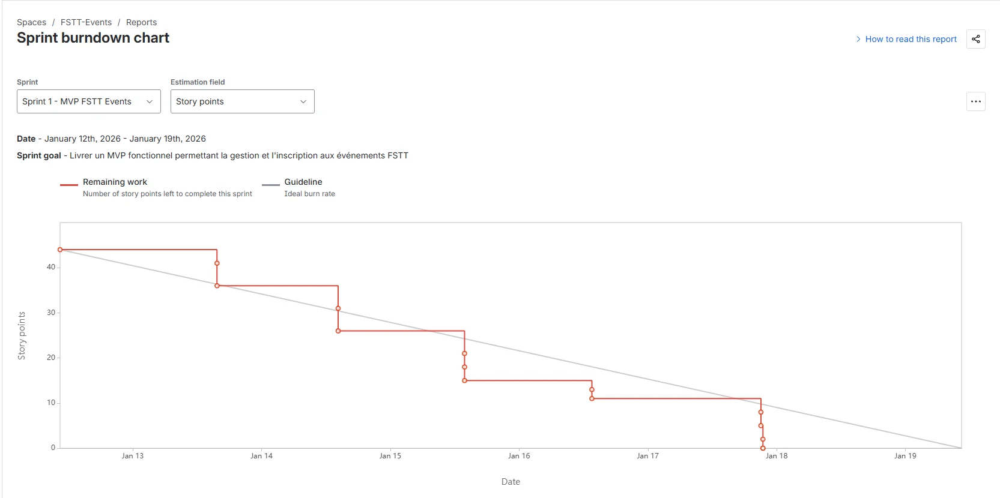

**Analyse :**

Le Burndown Chart montre l'évolution du travail restant (en Story Points) au cours du sprint.

- **Axe Y :** Story Points restants (de 44 à 0)
- **Axe X :** Jours du sprint (13-19 janvier)
- **Ligne grise (Guideline) :** Progression idéale linéaire
- **Ligne rouge (Remaining work) :** Progression réelle

**Observations :**
- Le sprint a démarré avec 44 Story Points
- La progression a été régulière tout au long du sprint
- Tous les points ont été complétés avant la fin du sprint
- La courbe réelle suit globalement la courbe idéale, indiquant une bonne planification

**Interprétation :**
- L'équipe a maintenu un rythme constant
- Les estimations étaient réalistes
- Le Sprint Goal a été atteint avec succès

### 10.2 Velocity Report

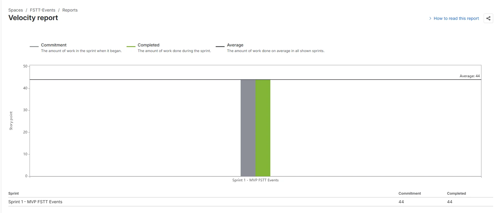

**Analyse :**

Le Velocity Report affiche la capacité de l'équipe en Story Points :

| Sprint | Commitment | Completed |
|--------|------------|-----------|
| Sprint 1 - MVP FSTT Events | 44 | 44 |

- **Commitment (gris) :** Points engagés au début du sprint = 44
- **Completed (vert) :** Points réellement complétés = 44
- **Average :** Vélocité moyenne = 44

**Observations :**
- 100% des Story Points engagés ont été livrés
- La vélocité de l'équipe est de 44 points par sprint

**Utilité pour les futurs sprints :**
- Cette vélocité servira de référence pour planifier les prochains sprints
- L'équipe peut s'engager sur environ 44 points par sprint d'une semaine

### 10.3 Cumulative Flow Diagram

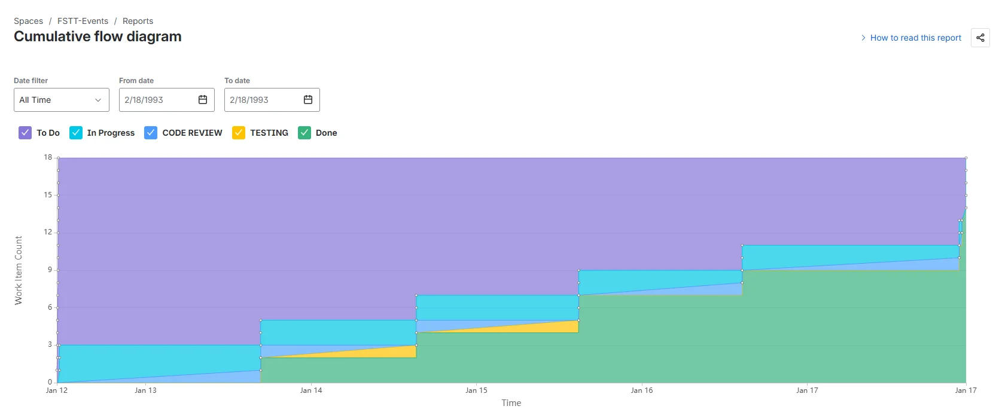

**Analyse :**

Le Cumulative Flow Diagram montre l'évolution des items dans chaque statut au fil du temps :

- **Bleu (To Do) :** Tâches en attente
- **Cyan (In Progress) :** Tâches en développement
- **Jaune (Code Review) :** Tâches en revue de code
- **Jaune-vert (Testing) :** Tâches en test
- **Vert (Done) :** Tâches terminées

**Observations :**
- La zone "Done" (vert) croît progressivement, indiquant une livraison continue
- Les zones intermédiaires (In Progress, Code Review, Testing) restent fines, signe d'un bon flux
- Pas d'accumulation visible dans une phase particulière

**Interprétation :**
- Le workflow est fluide, sans goulot d'étranglement
- Les tâches passent rapidement d'un statut à l'autre
- L'équipe travaille efficacement avec le workflow amélioré

---

## 11. Sprint Review

### 11.1 Résumé du Sprint

| Métrique | Valeur |
|----------|--------|
| **Sprint** | Sprint 1 - MVP FSTT Events |
| **Durée** | 7 jours (12-19 janvier 2026) |
| **Story Points engagés** | 44 |
| **Story Points livrés** | 44 |
| **User Stories complétées** | 13/13 (100%) |

### 11.2 Fonctionnalités Livrées

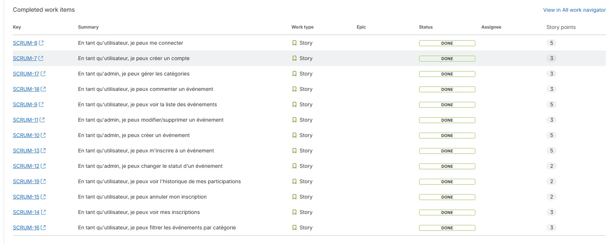

| ID | User Story | Statut |
|----|------------|--------|
| SCRUM-7 | Créer un compte | ✅ DONE |
| SCRUM-8 | Se connecter | ✅ DONE |
| SCRUM-9 | Voir la liste des événements | ✅ DONE |
| SCRUM-10 | Créer un événement | ✅ DONE |
| SCRUM-11 | Modifier/supprimer un événement | ✅ DONE |
| SCRUM-12 | Changer le statut d'un événement | ✅ DONE |
| SCRUM-13 | S'inscrire à un événement | ✅ DONE |
| SCRUM-14 | Voir mes inscriptions | ✅ DONE |
| SCRUM-15 | Annuler mon inscription | ✅ DONE |
| SCRUM-16 | Filtrer les événements par catégorie | ✅ DONE |
| SCRUM-17 | Gérer les catégories | ✅ DONE |
| SCRUM-18 | Commenter un événement | ✅ DONE |
| SCRUM-19 | Voir l'historique de mes participations | ✅ DONE |

### 11.3 Démonstration

La démonstration a couvert les scénarios suivants :

1. **Scénario Admin :**
   - Connexion avec compte administrateur
   - Création d'un nouvel événement
   - Modification du statut
   - Gestion des catégories
   - Visualisation des inscrits

2. **Scénario Utilisateur :**
   - Création de compte
   - Inscription à un événement
   - Consultation de "Mes inscriptions"
   - Ajout d'un commentaire
   - Annulation d'inscription
   - Consultation de l'historique

### 11.4 Feedback du Product Owner

- ✅ Toutes les fonctionnalités demandées sont présentes
- ✅ L'interface est intuitive et facile à utiliser
- ✅ La distinction Admin/User fonctionne correctement
- ✅ Le Sprint Goal est atteint

### 11.5 Décisions pour la Suite

Pour un éventuel Sprint 2, les améliorations suivantes pourraient être envisagées :
- Ajout de notifications par email
- Système de rappel avant les événements
- Export des listes de participants
- Amélioration du design de l'interface

---

## 12. Sprint Retrospective

### 12.1 Format Utilisé

Nous avons utilisé le format **"Start, Stop, Continue"** pour structurer notre rétrospective.

### 12.2 Ce qui a bien fonctionné (Continue)

| Point positif | Impact |
|---------------|--------|
| **Communication régulière** | Les Daily meetings ont permis de détecter rapidement les problèmes |
| **Workflow amélioré** | Les statuts CODE REVIEW et TESTING ont amélioré la qualité |
| **Découpage clair des User Stories** | Facilite l'estimation et le suivi |
| **Stack technique adaptée** | FastAPI + React = développement rapide |
| **Collaboration équipe** | Bonne entraide entre les membres |

### 12.3 Ce qui peut être amélioré (Start/Stop)

| Point à améliorer | Action proposée |
|-------------------|-----------------|
| **Documentation** | Commencer à documenter le code dès le début |
| **Tests automatisés** | Ajouter des tests unitaires |
| **Revue de code formelle** | Mettre en place des pull requests systématiques |
| **Estimation** | Affiner les estimations avec plus d'expérience |

### 12.4 Actions pour le Prochain Sprint

1. **Mettre en place des tests unitaires** - Assigné à EL AJBARI Youssef
2. **Créer une documentation technique** - Assigné à OUALLALI Mohamed Amine
3. **Formaliser le processus de code review** - Assigné à BERQIA Badr (SCRUM Master)

### 12.5 Métriques de Satisfaction

| Critère | Note (1-5) |
|---------|------------|
| Atteinte du Sprint Goal | ⭐⭐⭐⭐⭐ |
| Collaboration d'équipe | ⭐⭐⭐⭐⭐ |
| Qualité du code | ⭐⭐⭐⭐ |
| Respect des délais | ⭐⭐⭐⭐⭐ |
| Communication | ⭐⭐⭐⭐⭐ |

---

## 13. Conclusion

### 13.1 Bilan du Projet

Ce projet nous a permis de mettre en pratique la méthodologie SCRUM dans un contexte réel de développement logiciel. Les principaux apprentissages sont :

1. **Organisation efficace :** La structure SCRUM (Sprint Planning, Daily, Review, Retrospective) apporte un cadre clair pour le développement.

2. **Transparence :** Les outils Jira (Board, Burndown Chart, Velocity Report) offrent une visibilité complète sur l'avancement du projet.

3. **Adaptabilité :** La méthode permet de s'adapter rapidement aux changements et aux imprévus.

4. **Collaboration :** Les cérémonies SCRUM favorisent la communication et la collaboration au sein de l'équipe.

### 13.2 Résultats Obtenus

- ✅ Application fonctionnelle livrée dans les délais
- ✅ 100% des User Stories complétées
- ✅ Sprint Goal atteint
- ✅ Vélocité de 44 Story Points établie
- ✅ Workflow personnalisé et efficace

### 13.3 Perspectives

L'application FSTT Events peut évoluer avec :
- De nouveaux sprints pour ajouter des fonctionnalités
- Une mise en production pour utilisation réelle
- L'intégration avec d'autres systèmes de la FSTT

---

## Annexes

### Annexe A : Captures d'Écran Jira

Les captures d'écran Jira sont intégrées dans le rapport aux sections suivantes :
- **Section 10.1** : Sprint Burndown Chart
- **Section 10.2** : Velocity Report
- **Section 10.3** : Cumulative Flow Diagram
- **Section 11.2** : Completed Work Items

### Annexe B : Structure du Code

```
fstt-events/
├── api/
│   ├── main.py          # Backend FastAPI
│   ├── requirements.txt # Dépendances Python
│   └── fstt_events.db   # Base de données SQLite
└── web/
    ├── src/
    │   ├── App.jsx      # Composant principal React
    │   └── main.jsx     # Point d'entrée
    ├── index.html
    ├── package.json
    └── vite.config.js
```

### Annexe C : API Endpoints

| Méthode | Endpoint | Description |
|---------|----------|-------------|
| POST | /auth/register | Créer un compte |
| POST | /auth/login | Se connecter |
| GET | /events | Liste des événements |
| POST | /events | Créer un événement |
| PUT | /events/{id} | Modifier un événement |
| DELETE | /events/{id} | Supprimer un événement |
| PATCH | /events/{id}/status | Changer le statut |
| GET | /categories | Liste des catégories |
| POST | /categories | Créer une catégorie |
| PUT | /categories/{id} | Modifier une catégorie |
| DELETE | /categories/{id} | Supprimer une catégorie |
| POST | /events/{id}/register | S'inscrire à un événement |
| DELETE | /registrations/{id} | Annuler une inscription |
| GET | /users/{id}/registrations | Mes inscriptions |
| GET | /users/{id}/history | Historique des participations |
| GET | /events/{id}/comments | Commentaires d'un événement |
| POST | /events/{id}/comments | Ajouter un commentaire |
| DELETE | /comments/{id} | Supprimer un commentaire |

### Annexe D : Captures d'écran FSTT Events
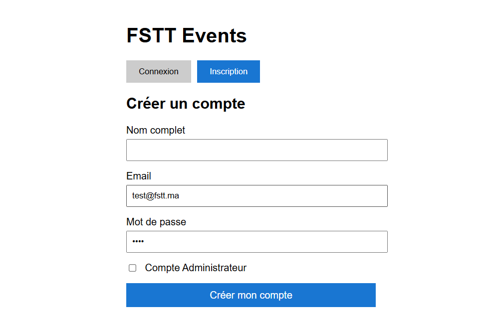
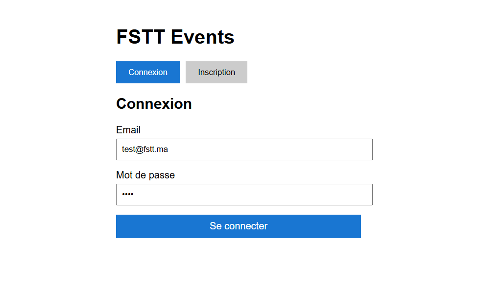
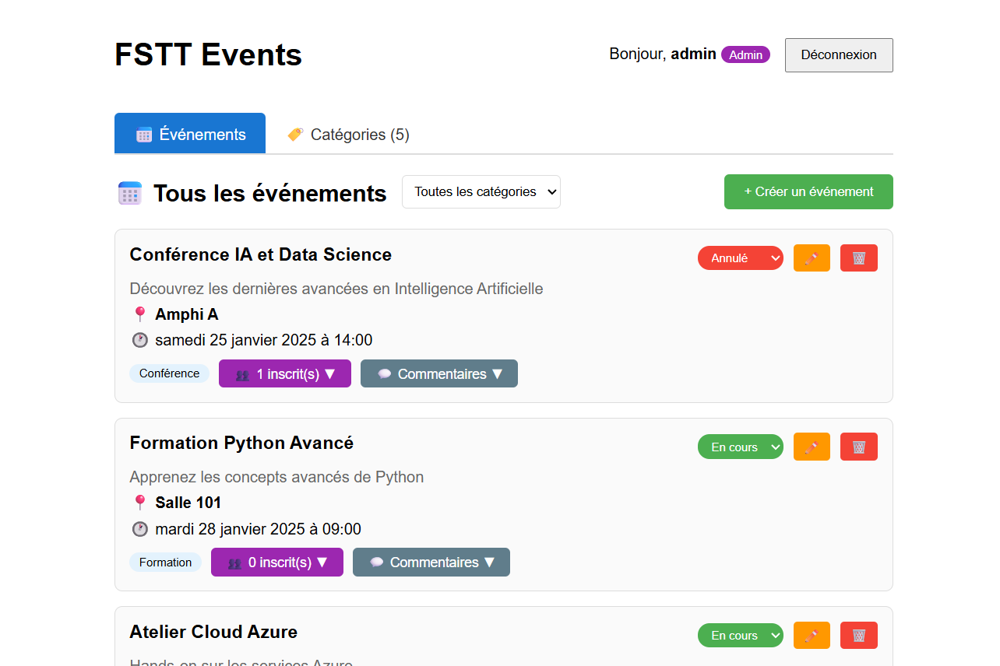
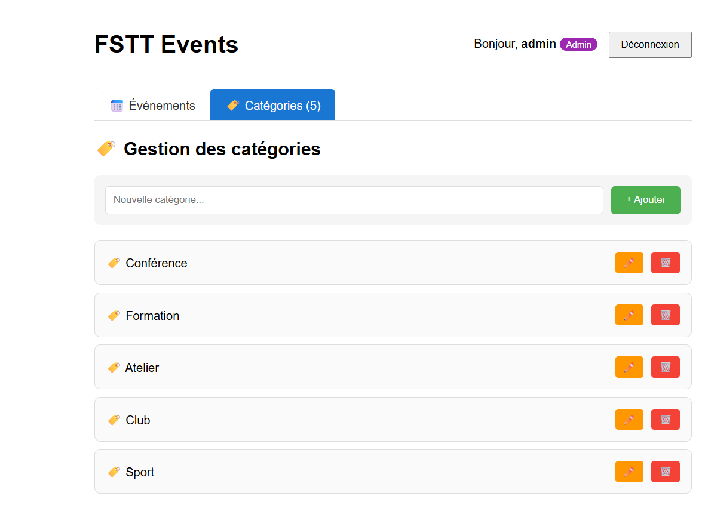
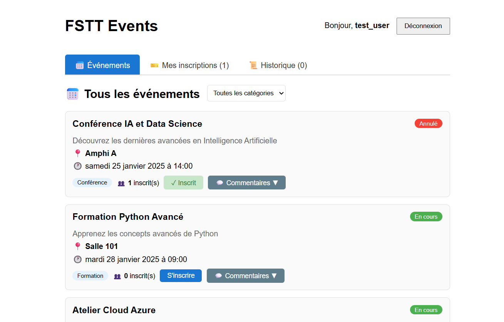
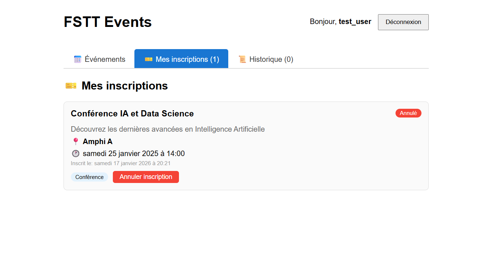
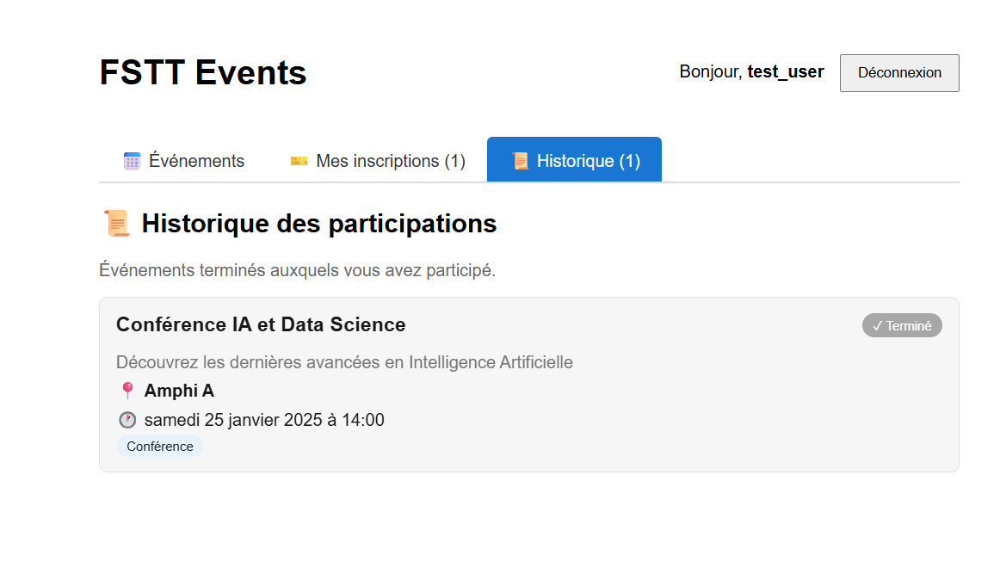

